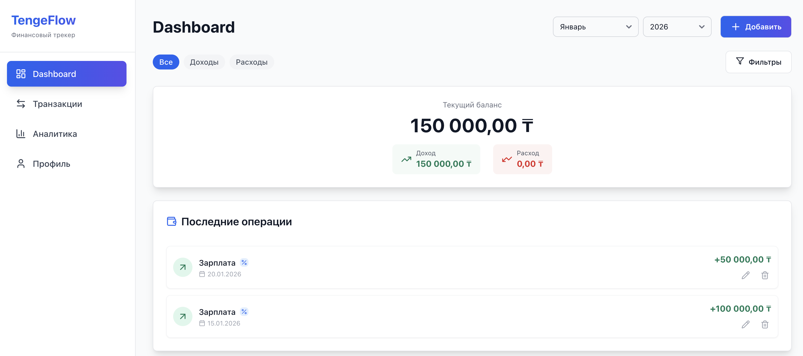
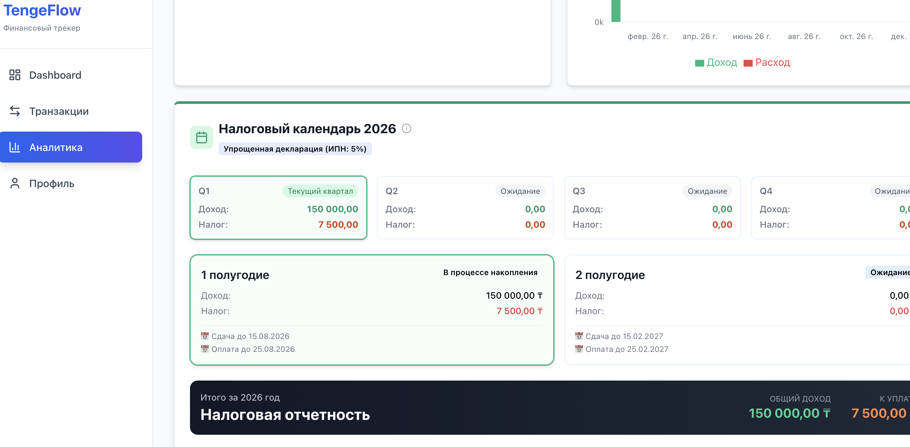
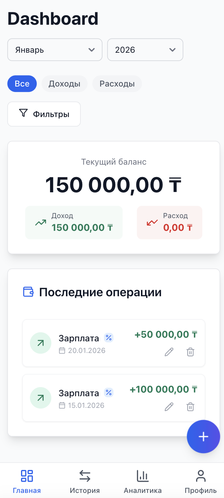

# 💰 TengeFlow


> **TengeFlow** — современное PWA-приложение для учета финансов и налогов в Казахстане, разработанное с фокусом на UX, производительность и мобильную доступность.

[](https://reactjs.org/)
[](https://vitejs.dev/)
[](https://firebase.google.com/)
[](https://tailwindcss.com/)
[](https://web.dev/progressive-web-apps/)
[](https://playwright.dev/)

---

## 🚀 О проекте

**TengeFlow** решает проблему сложного налогового учета для ИП в Казахстане. Это не просто трекер расходов, а полноценный финансовый ассистент, который помогает предпринимателям контролировать свои обязательства перед государством в режиме реального времени.

### ✨ Ключевые возможности

*   **📱 Progressive Web App (PWA)**: Устанавливается как нативное приложение на iOS и Android. Работает офлайн благодаря стратегии *CacheFirst* и *StaleWhileRevalidate*.
*   **📊 Умная Аналитика**: Интерактивные графики (Recharts) для визуализации доходов, расходов и налоговой нагрузки.
*   **🇰🇿 Налоговый Монитор**: Автоматический расчет налогов (ИПН, Соц. налог) с учетом специфики налогового кодекса РК.
*   **⚡ Real-time Sync**: Мгновенная синхронизация данных между устройствами через **Firestore**.
*   **🔔 Smart Notifications**: Система уведомлений с авто-закрытием, паузой при наведении и визуальным прогресс-баром.
*   **🎨 Современный UI/UX**: Адаптивный дизайн (Mobile First), темная тема (planned), интерактивные фильтры и плавные анимации.

---

## �️ Технический стек

Проект построен на современных решениях для обеспечения максимальной производительности и масштабируемости:

| Категория | Технологии |
|-----------|------------|
| **Core** | React 18, JavaScript (ES6+) |
| **Build Tool** | Vite 6 (Fast HMR & Optimized Build) |
| **Styling** | Tailwind CSS v3.4, Flowbite, Lucide Icons |
| **Backend** | Firebase (Auth, Firestore, Hosting) |
| **State** | React Context API |
| **Testing** | Vitest (Unit), Playwright (E2E) |
| **PWA** | vite-plugin-pwa, Workbox |
| **Charts** | Recharts |

---

## 🧪 Качество кода и Тестирование

Особое внимание уделено стабильности приложения. В проекте реализована двухуровневая система тестирования:

1.  **Unit Testing (Vitest)**:
    *   Покрытие бизнес-логики (расчет налогов, валидация).
    *   Тестирование UI-компонентов.
    *   *20+ активных тестов.*

2.  **E2E Testing (Playwright)**:
    *   Полная симуляция пользовательского пути (Registration -> Transaction -> Analytics).
    *   Проверка работы в офлайн-режиме.
    *   Скриншот-тестирование верстки.

---

## � Галерея

| Dashboard | Analytics | Mobile View |
|-----------|-----------|-------------|
|  |  |  |

---

## 🏁 Запуск проекта

### Локальная разработка

```bash
# 1. Клонирование репозитория
git clone https://github.com/NeoN1X337/tengeflow.git

# 2. Установка зависимостей
npm install

# 3. Запуск dev-сервера
npm run dev
```

### Сборка и Тесты

```bash
# Запуск Unit тестов
npm run test:unit

# Запуск E2E тестов
npm run test:e2e

# Сборка для продакшена (включая PWA ассеты)
npm run build
```

---

## 👤 Автор

**Zhenisuly A.**
*   [GitHub](https://github.com/NeoN1X337) | [LinkedIn](https://www.linkedin.com/in/7henisuly/)

---

*Made with ❤️ for Kazakhstan FinTech*